# Selfish Tokens: Hard Negative Sampling to Improve the Performance of Language Models in Low-Resource Languages

Some studies (e.g., [this paper](https://arxiv.org/pdf/2306.16842)) have shown a correlation between the performance of language models and the entropy of the token distribution.

At the same time, the distribution of languages in text corpora is not uniform. For example, [GPT-3 was trained on data](https://github.com/openai/gpt-3/blob/master/dataset_statistics/languages_by_word_count.csv) where less than 2% of words are in the second most popular language (French). [Another work](https://arxiv.org/pdf/2311.09205) shows that adding multilingual data improves performance initially, but adding too much multilingual data eventually decreases the model's performance in low-resource languages.

In this project, I formulate a hypothesis on why the imbalance of the token distribution affects a model's performance, and I propose a method to improve the model's ability to predict less frequent tokens.

## Hypothesis

In this work, I assume that the language model uses [weight tying](https://paperswithcode.com/method/weight-tying) — sharing the weights of the embedding and softmax layers—since it usually improves performance and is implemented in nearly all modern language models.

Token embeddings, although they are parameters of the model, are different from other parameters. Typically, the parameters of language models are used to predict every new token, and because of that, they receive gradients at every step of training. While Mixture of Experts models theoretically allow the model to use only part of its weights, there is usually an additional loss added to encourage all experts to have equal importance and to be trained uniformly.

With weight tying, the embedding matrix is used twice: first as the embeddings of input tokens, and then as the weights of the output classification layer. These two usages are somewhat different.

Token embedding optimizations can be categorized into three types:

1. **Embedding of the input token**: We optimize the embedding to provide as much useful information as possible to predict the next tokens in the sentence.

2. **Output embedding optimization**: We compare the output of the language model with the embeddings of tokens, aiming to bring the target token's embedding closer to the model's output than other tokens' embeddings.
   - **2.1**: When token **T** is the target token at position *i*, we try to maximize $P(\text{sentence}[i] = T)$.
   - **2.2**: When token **T** is not the target token at position *i*, we try to minimize $P(\text{sentence}[i] = T)$.

For example:

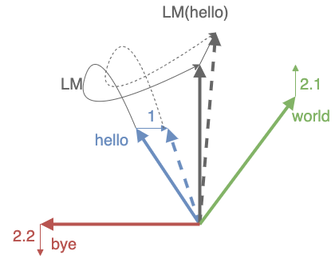

The text is "hello world". We aim to optimize the model so that LM("hello") becomes closer to the embedding of "world". To achieve this, we:

- **1.** Adjust the embedding of "hello" so that LM("hello") moves closer to the embedding of "world".
- **2.1.** Move the embedding of the target token "world" closer to LM("hello").
- **2.2** Move the embedding of a non-target token, like "bye", away from LM("hello").

Each row of the embedding matrix is optimized by scenarios 1 and 2.1 only within sentences where the specific token occurs. Scenario 2.2 is different; all rows of the embedding matrix are optimized by scenario 2.2 at every step of training, regardless of the occurrence of the specific tokens. Moreover, optimization in scenario 2.2 does not directly improve the performance of the model related to the specific token corresponding to that embedding row, but rather affects the representation of the target token.

My hypothesis is that for rare tokens, the proportion of optimization from scenario 2.2 is significantly larger than that from scenarios 1 and 2.1. Consequently, these rare tokens do not receive sufficient information from their contextual occurrences, and the "noise" from scenario 2.2 hinders the model's ability to learn meaningful representations for them.

## Proposed method

To reduce the "noise" from scenario 2.2, I propose a method to make tokens more "selfish" and focus more on scenarios 1 and 2.1, where tokens have meaningful contexts to learn from. To achieve this, I add a simple step after the language model (LM) head before calculating the cross-entropy loss.

Suppose the LM predicts the target token with probability $P(\text{target})$. If there are any tokens that have predicted probabilities greater than $P(\text{target})$, it makes sense to push their probabilities down. However, for a token **T** where $P(T) \ll P(target)$, it is already sufficiently far from the target token, and we may ignore it—allowing such "distant" tokens to be optimized in their own contexts.

Essentially, we need to ignore tokens with $P(T) \ll P(\text{target})$. To do this, I implement the following:

```python
# Pseudocode
# For each target token, set a threshold as logits[target] - margin
threshold = logits[targets] - margin
# Wipe out logits that are too small
logits[logits < threshold] = -float('inf')
```

By applying this thresholding with a margin (e.g., `margin = 2`), we effectively eliminate probabilities less than $P(\text{target}) \times e^{-\text{margin}}$, narrowing the focus to hard negative samples.

For example:

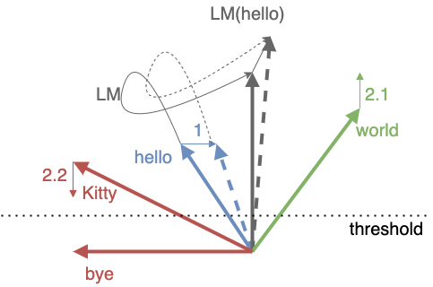

After applying the threshold with a `margin = 2`, the logits for the token "bye" become -inf, and optimization scenario 2.2 is no longer applied to it. However, the logits for another token "Kitty" remain above the threshold, so optimization scenario 2.2 will still be applied to "Kitty". "Kitty" is a hard negative example here.

`margin` is a hyperparameter. In my experiments I chose `margin = 2`. By choosing `margin = 2`, we eliminate tokens where:

$P(T) < P(\text{target}) \times e^{-2}$

Since $e^{-2} \approx 0.14$, we have:

$P(T) < P(\text{target}) \times 0.14$

The value 0.14 is sufficiently small for our purposes. Determining the optimal `margin` is an area for future research.

## Experiments

For this project, I used a small dataset of Shakespeare's texts and trained a character-level language model on it. There are only 65 unique characters with a high imbalance in their distribution:

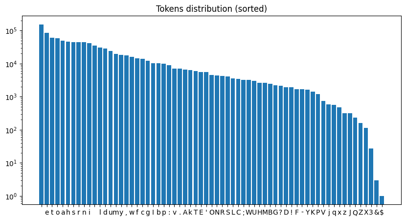

During training, I logged gradients from each optimization scenario. The plot below shows the summed gradient norms (y-axis) for different tokens (x-axis) across the three optimization types:

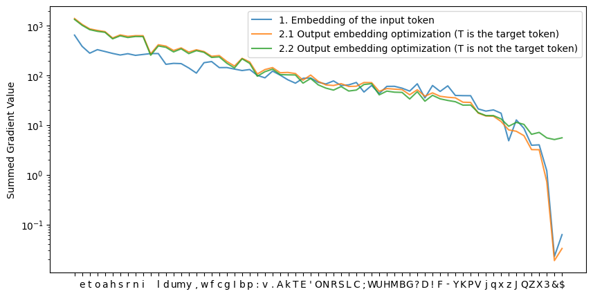

It is evident that for the less frequent tokens, the optimization weight from scenario 2.2 is higher than those from the other scenarios.

## Comparison Between Standard LM Training and LM Training with Hard Negative Sampling

To understand the impact of hard negative sampling, I need to analyze tokens grouped by their popularity. Instead of calculating a single average loss, we compute the loss for each of the 65 unique characters individually. Then, I group these characters in sets of 10, from the most popular to the least popular, and calculate the average loss for each group.

First, let's examine the loss for the 10 most popular tokens. Standard training results in a lower loss because it directly minimizes the loss:

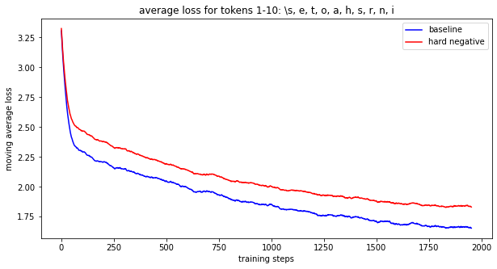

When we look at the less popular tokens, however, the results are different. Here, the training with hard negative sampling shows a lower average loss compared to standard training. The plot below illustrates this for tokens ranked 41-50 in terms of popularity:

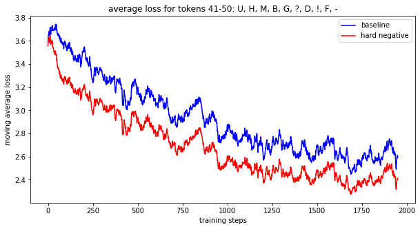

This suggests that while standard training excels with frequent tokens, hard negative sampling provides an advantage in learning more meaningful representations for rare tokens.

## Training multilangual LM simulation

Previously, our character-level tokenizer worked as follows:

```
def encode(sentence):
   return [c2token_id[c] for c in sentence]
```

To simulate multilingual data, I updated the tokenizer similarly to the method described [here](https://openreview.net/pdf?id=HJeT3yrtDr). In 2% of the sentences, the tokenizer returns `c2token_id[c] + vocab_size`:

```
def encode(sentence):
   big_language_prob = 0.98
   if language == 'random':
      current_language = 'big' if torch.rand(1).item() < big_language_prob else 'small'
   if language == 'big':
      return [c2token_id[c] for c in sentence]
   else:
      return [c2token_id[c]+vocab_size for c in sentence]
```

This creates two distinct sets of tokens:

- **98%** of the sentences use token IDs within the range `[0, vocab_size)`, simulating a high-resource language.
- **2%** of the sentences use token IDs within `[vocab_size, 2 * vocab_size)`, representing a low-resource language.

By adjusting the tokenizer in this way, we effectively simulate a multilingual dataset where the low-resource language shares no tokens with the high-resource language. This setup allows us to study how the model learns representations for rare tokens that appear only in the low-resource language.

I conducted three experiments to explore the effects of different training methods:

1. **Baseline**: Standard training process.
2. **Hard Negative Sampling**: Training with hard negative sampling using a `margin = 2`.
3. **Small-Language-Only Training**: A simulation of proportional compute distribution, where the model is trained solely on the low-resource language data for 50 times fewer steps than the baseline.

The plots below compare the losses across all data and specifically for the low-resource language data:

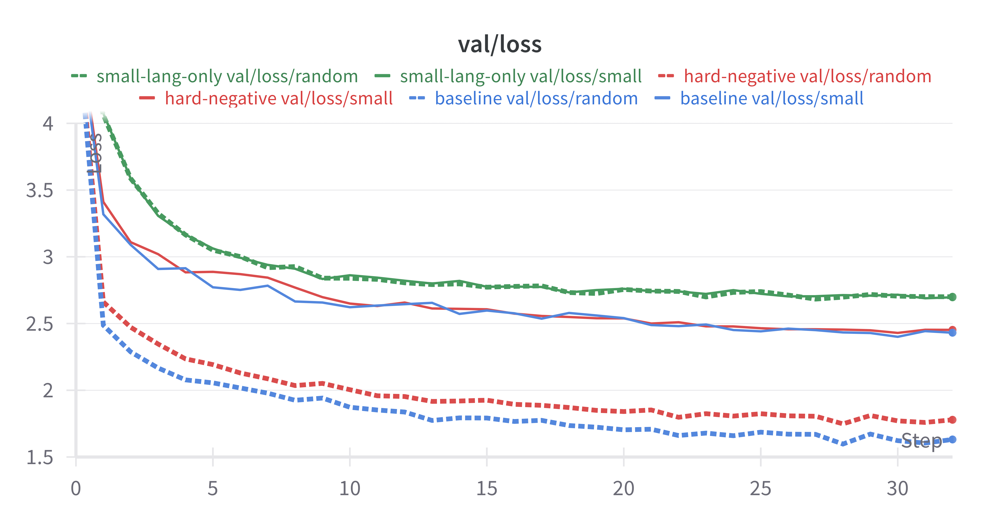

The baseline training achieves a better loss overall. However, when focusing on the low-resource data, the losses for the baseline and hard negative sampling methods are quite similar.

It's expected that the baseline has a lower loss due to the presence of long tails in the probability distribution. Here is the plot of probability distributions from the baseline model and the model with hard negative sampling:

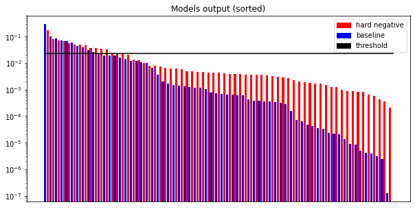

In the model with hard negative sampling, even though the probabilities for many tokens are lower than the threshold, they are not optimized further. Consequently, these probabilities remain higher than those from the baseline model. This long tail of probabilities reduces the probability of the target token and increases the loss for the model with hard negative sampling.

Modern language models widely use sampling techniques like top-k sampling or nucleus sampling to eliminate the ["unreliable tail"](https://arxiv.org/pdf/1904.09751) of low-probability tokens. If we set a `top_p` for nucleus sampling that we will use later, with a large enough margin, we can train the model to optimize non-target tokens \( T \) so that \( P(T) \) decreases until it is outside of `top_p`.

**Lemma**:

If
$$
P(T) < \frac{1 - \text{top\_p}}{\text{vocab\_size}},
$$
then $T$ is outside of `top_p` in nucleus sampling.

**Proof:**

Assume the opposite—that $T$ is inside `top_p`. Then there are $n ( < vocab_size)$ tokens $\{T_i\}$ such that for any $T_i$, $P(T_i) \leq P(T)$, and
$$
1 - \text{top\_p} < \sum_i P(T_i).
$$
Then:
$$
\begin{align*}
1 - \text{top\_p} &< \sum_i P(T_i) \leq \text{vocab\_size} \times P(T) \\
&< \text{vocab\_size} \times \frac{1 - \text{top\_p}}{\text{vocab\_size}} = 1 - \text{top\_p}.
\end{align*}
$$
This is a contradiction, so \( T \) must be outside of `top_p`.

To ensure $P(T) < \frac{1 - \text{top\_p}}{\text{vocab\_size}}$, and since $P(\text{target}) < 1$, we can optimize $T$ until:
$$
P(T) < P(\text{target}) \times \frac{1 - \text{top\_p}}{\text{vocab\_size}}.
$$

To achieve this, we need:
$$
e^{-\text{margin}} = \frac{1 - \text{top\_p}}{\text{vocab\_size}}, \\
\text{margin} = \ln(\text{vocab\_size}) - \ln(1 - \text{top\_p}).
$$

For example, for a vocabulary size of 200,000 and \( \text{top\_p} = 99\% \), we need:
$$
\text{margin} = \ln(200{,}000) - \ln(0.01) \approx 16.8.
$$

Between this large margin and a small margin (which adversely affects the loss), there should be a balanced choice that doesn't harm the loss too much while still improving performance for low-resource languages.

## Hard negative sampling improve ranking of target tokens:

There is evidence that the performance of the model with hard negative sampling can be better than the baseline model. While the model with hard negative sampling may not perform as well in terms of absolute probabilities of target tokens, it ranks target tokens higher than the baseline model. Below are the accuracy, recall@5, and Mean Reciprocal Rank (MRR) metrics. In all three metrics, the model with hard negative sampling performs better than the baseline. Surprisingly, it performs better not only for the low-resource language but also slightly better for the high-resource language.

Next, we examine the top-1 accuracy, recall@5, and MRR for the different training methods:


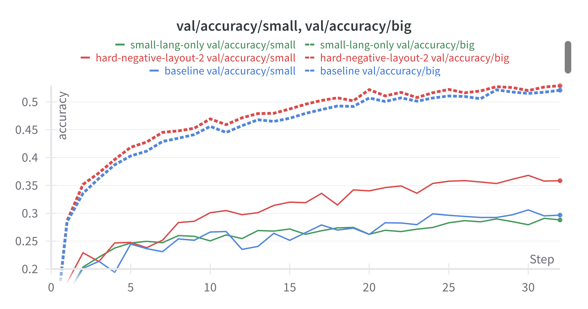

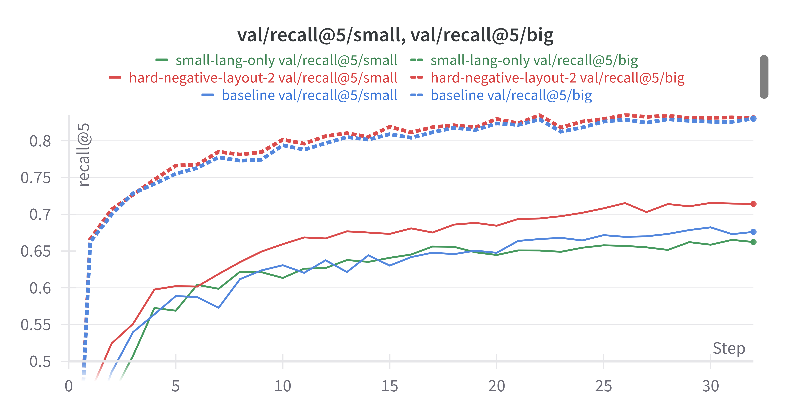

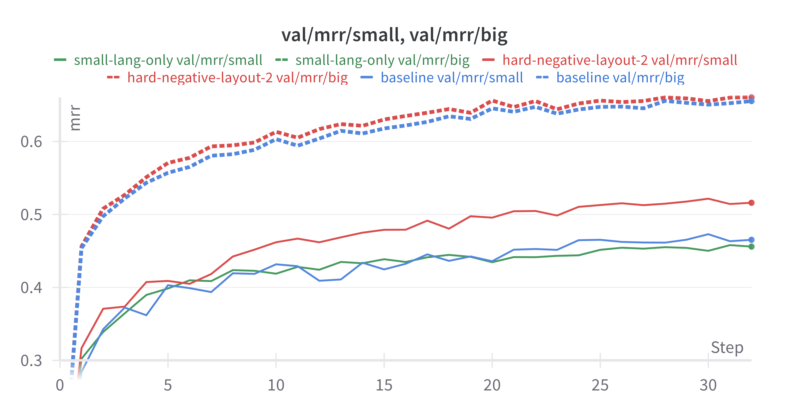

Here, we observe that the hard negative sampling approach significantly outperforms the baseline in the low-resource language data. Interestingly, it also performs slightly better on the high-resource language data, indicating that hard negative sampling may have beneficial effects even beyond low-resource scenarios.

## Embeddings comparison

Below is a comparison of embedding positions after baseline training and hard negative sampling. These visualizations use a 2D t-SNE projection of the embedding vectors, where high-resource language embeddings are marked in blue, and low-resource language embeddings are marked in red. The `i-th` and `i+vocab_size` tokens are connected by lines.

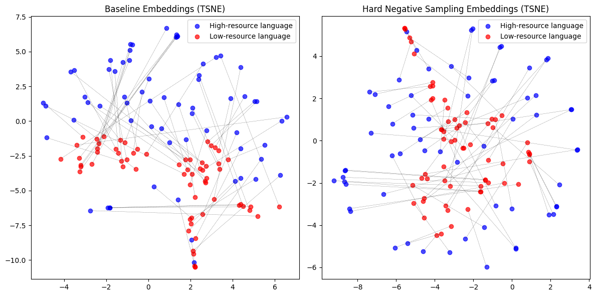

It's challenging to draw concrete conclusions from this visualization, so let's take a look at the PCA 2D projections to identify any interesting patterns.

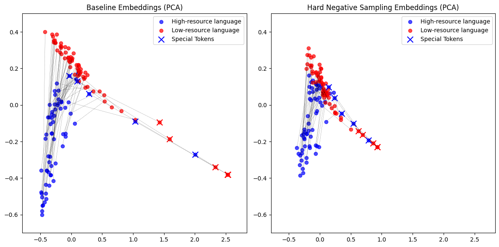

There are two clear directions in both sets of model embeddings. One direction separates the languages, while the other separates the rare tokens (the five least popular tokens are marked with an 'x' shape). However, in the model trained with hard negative sampling, the distances between languages and between rare and other tokens are smaller. This suggests that the tokens repel each other less and potentially learn more meaningful information during hard sampling training.

Despite the reduced gap, the persistent separation between languages in the hard-sampling-trained model indicates that there is still room for a more aggressive margin selection during hard negative sampling.

## TODO
- Try more aggressive margin for hard negative sampling. Layout Scheduling?
- Test with Larger Model and More Data.
- Evaluate with More Realistic Metrics.