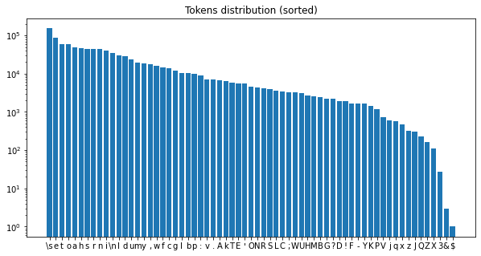

# Selfish Tokens: Hard Negative Sampling to Improve the Performance of Language Models in Low-Resource Languages

Some studies (e.g., [this paper]((https://arxiv.org/pdf/2306.16842))) have shown a correlation between the performance of language models and the entropy of the token distribution.

At the same time, the distribution of languages in text corpora is not uniform. For example, [GPT-3 was trained on data](https://github.com/openai/gpt-3/blob/master/dataset_statistics/languages_by_word_count.csv) where less than 2% of tokens are in the second most popular language (French)

In this project, I formulate a hypothesis on why the imbalance of the token distribution affects a model's performance, and I propose a method to improve the model's ability to predict less frequent tokens.

## Hypothesis

Token embedding optimizations can be categorized into three types:

1. **Embedding of the input token**: We optimize the embedding to provide as much useful information as possible to predict the next tokens in the sentence.

2. **Output embedding optimization**: We compare the output of the language model with the embeddings of tokens, aiming to bring the target token's embedding closer to the model's output than other tokens' embeddings.
   - **2.1**: When token **T** is the target token at position *i*, we try to maximize $P(\text{sentence}[i] = T)$.
   - **2.2**: When token **T** is not the target token at position *i*, we try to minimize $P(\text{sentence}[i] = T)$.

Scenario 2.2 is unique because it affects all tokens, regardless of their presence in the current batch. When a token is optimized under scenario 2.2, it does not directly improve its own representation but rather influences the representation of other tokens. My hypothesis is that for rare tokens, the optimization weight from scenario 2.2 is significantly larger than that from scenarios 1 and 2.1. Consequently, these rare tokens do not receive sufficient information from their contextual occurrences, and the "noise" from scenario 2.2 hinders the model's ability to learn meaningful representations for them.

## Proposed method

To reduce the "noise" from scenario 2.2, I propose a method to make tokens more "selfish" and focus more on scenarios 1 and 2.1, where tokens have meaningful contexts to learn from. To achieve this, I add a simple step after the language model (LM) head before calculating the cross-entropy loss.

Suppose the LM predicts the target token with probability $P(\text{target})$. If there are any tokens that have predicted probabilities greater than $P(\text{target})$, it makes sense to push their probabilities down to zero. However, for a token **T** where $P(T) \ll p$, it is already sufficiently far from the target token, and we may ignore it—allowing such "distant" tokens to be optimized in their own contexts.

Essentially, we need to ignore tokens with $P(T) \ll P(\text{target})$. To do this, I implement the following:

```python
# Pseudocode
# For each target token, set a threshold as logits[target] - layout
threshold = logits[targets] - layout
# Wipe out logits that are too small
logits[logits < threshold] = -float('inf')
```

Due to the softmax function, this threshold eliminates probabilities that are less than $P(\text{target}) \times e^{-\text{layout}}$. In my experiments, I used `layout=2`

## Experiments

For this project, I used a small dataset of Shakespeare's texts and trained a character-level language model on it. There are only 65 unique characters with a high imbalance in their distribution:



During training, I logged gradients from each optimization scenario. The plot below shows the summed gradient norms (y-axis) for different tokens (x-axis) across the three optimization types:


It is evident that for the less frequent tokens, the optimization weight from scenario 2.2 is higher than those from the other scenarios.

## Comparison Between Standard LM Training and LM Training with Hard Negative Sampling

To understand the impact of hard negative sampling, I need to analyze tokens grouped by their popularity. Instead of calculating a single average loss, we compute the loss for each of the 65 unique characters individually. Then, I group these characters in sets of 10, from the most popular to the least popular, and calculate the average loss for each group.

First, let's examine the loss for the 10 most popular tokens. Standard training results in a lower loss because it directly minimizes the loss:


When we look at the less popular tokens, however, the results are different. Here, the training with hard negative sampling shows a lower average loss compared to standard training. The plot below illustrates this for tokens ranked 41-50 in terms of popularity:


This suggests that while standard training excels with frequent tokens, hard negative sampling provides an advantage in learning more meaningful representations for rare tokens.

